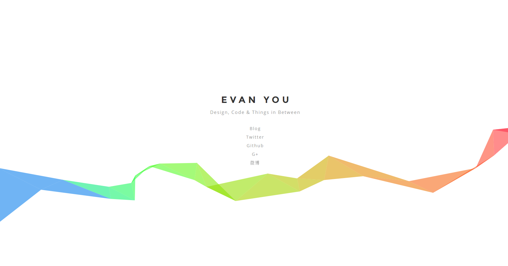

# ribbon.js

> Only 1kb javascript gist to generate a **ribbon** in your website with HTML5 canvas. Code from [evanyou](http://evanyou.me/).


## 1. usage

Very easy and simple.

insert the code below `between <body> and </body>`.

```html
<script src="dist/ribbon.min.js"></script>
```

Suggest before the tag `</body>`, like below:

```html
<html>
<head>
	...
</head>
<body>
	...
	...
	...
	<script src="dist/ribbon.min.js"></script>
</body>
</html>
```


`Please do not add the code in the <head> </head>`. then ok!


## 2. config

 - **`size`**: the size of ribbon, default: **`90`**.
 - **`alpha`**: the opacity of line (0 ~ 1), default: **`0.6`**.
 - **`zIndex`**: the index of z space, default: **`-1`**.

Example:

```html
<script type="text/javascript" size="150" alpha='0.3' zIndex="-2" src="dist/ribbon.min.js"></script>
```

Set the config on the script node `as a attribute`. all the config has the default value, you can choose to set any of them, or none of them.


## 3. preview



## 4. other

The project source comes from [http://evanyou.me/](http://evanyou.me/).
